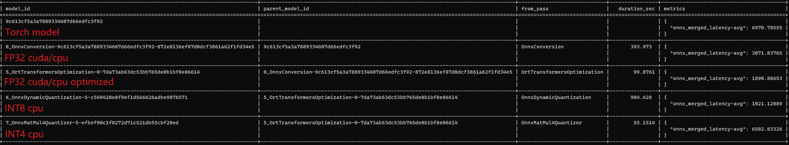
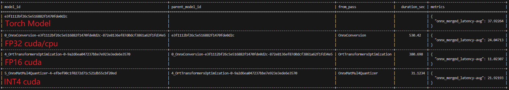

# Llama2 optimization
This folder contains sample use cases of Olive to optimize a [Llama2](https://huggingface.co/meta-llama/Llama-2-7b-hf)

## Optimization Workflows
### Optimize using ONNX Runtime Tools
Performs optimization pipeline:
- CPU, FP32: *PyTorch Model -> Onnx Model -> Transformers Optimized Onnx Model fp32*
- CPU, INT8: *PyTorch Model -> Onnx Model -> Transformers Optimized Onnx Model fp32 -> Onnx Dynamic Quantization*
- CPU, INT4: *PyTorch Model -> Onnx Model -> Transformers Optimized Onnx Model fp32 -> Onnx Block wise int4 Quantization*
- GPU, FP16: *PyTorch Model -> Onnx Model -> Transformers Optimized Onnx Model fp16 + Grouped Query Attention (optional)*
- GPU, INT4: *PyTorch Model -> Onnx Model -> Transformers Optimized Onnx Model fp16 + Grouped Query Attention (optional) -> Onnx Block wise int4 Quantization*

**Note:** Group Query Attention is optional and can be enabled by passing `--use_gqa` flag to the script. It is only supported for GPU.

Requirements file: [requirements.txt](requirements.txt)

### Fine-tune on a code generation dataset using QLoRA and optimize using ONNX Runtime Tools
This workflow fine-tunes Open LLaMA model using [QLoRA](https://arxiv.org/abs/2305.14314) to generate code given a prompt. The fine-tuned model is then optimized using ONNX Runtime Tools.
Performs optimization pipeline:
- GPU, NF4: *Pytorch Model -> Fine-tuned Pytorch Model -> Onnx Model -> Transformers Optimized Onnx Model fp16 -> Onnx Bitsandbytes 4bit Quantization*

**Note:**
- This workflow is only supported for GPU.
- The relevant config file is [llama2_qlora.json](llama2_qlora.json). The code language is set to `Python` but can be changed to other languages by changing the `language` field in the config file.
Supported languages are Python, TypeScript, JavaScript, Ruby, Julia, Rust, C++, Bash, Java, C#, and Go. Refer to the [dataset card](https://huggingface.co/datasets/nampdn-ai/tiny-codes) for more details on the dataset.
- You must be logged in to HuggingFace using `huggingface-cli login` to download the dataset or update `token` field in the config file with your HuggingFace token.

Requirements file: [requirements-qlora.txt](requirements-qlora.txt)

## Prerequisites
### Clone the repository and install Olive

Refer to the instructions in the [examples README](../README.md) to clone the repository and install Olive.

### Install onnxruntime
This example requires onnxruntime>=1.16.2. Please install the latest version of onnxruntime:

For CPU:
```bash
python -m pip install "onnxruntime>=1.16.2"
```

For GPU:
```bash
python -m pip install "onnxruntime-gpu>=1.16.2"
```

**Note:** The GPU package also works for CPU.

### Install extra dependencies
Install the necessary python packages:
```
python -m pip install -r <requirements_file>.txt
```

## Run the config to optimize the model
### Optimize using ONNX Runtime Tools
You can only generate the optimized config file by running the following command for double checking before running the optimization pipeline:
```bash
python llama2.py --model_name meta-llama/Llama-2-7b-hf --only_config
```

Or you can run the following command to directly optimize the model:

CPU:
```bash
# run to optimize the model: FP32/INT8/INT4
python llama2.py --model_name meta-llama/Llama-2-7b-hf
```

GPU:
```bash
# run to optimize the model: FP16/INT4
python llama2.py --model_name meta-llama/Llama-2-7b-hf --gpu
# use gqa instead of mha
python llama2.py --model_name meta-llama/Llama-2-7b-hf --gpu --use_gqa
```

### Fine-tune on a code generation dataset using QLoRA and optimize using ONNX Runtime Tools
Run the following command to execute the workflow:
```bash
python -m olive.workflows.run --config lamma2_qlora.json
```


## Performance comparison
### meta-llama/Llama-2-7b-hf

| Device | Framework | Precision | Latency (ms) |
| :--- | :--- | :---: | :--- |
| **CPU** | | | |
| CPU | PyTorch | FP32 | 6970.78555 |
| CPU | ONNX Runtime | FP32 | 1890.88653 |
| CPU | ONNX Runtime | INT8 | <span style="color:green">1021.12089</span> |
| CPU | ONNX Runtime | INT4 | 6502.83326 |
| **GPU-A100** | | |  |
| GPU-A100 | PyTorch | FP32 | 37.87534 |
| GPU-A100 | ONNX Runtime | FP32 | 24.04713 |
| GPU-A100 | ONNX Runtime | FP16 | <span style="color:green">11.02307</span> |
| GPU-A100 | ONNX Runtime | INT4 | 21.92193 |
| **GPU-V100** | | | |
| GPU-V100 | PyTorch | FP16 | 122.27091 |
| GPU-V100 | ONNX Runtime | FP32 | 195.86112 |
| GPU-V100 | ONNX Runtime | FP16 | <span style="color:green">52.72360</span> |
| GPU-V100 | ONNX Runtime | INT4 | 118.51050 |

1. cpu info:  Intel(R) Xeon(R) Platinum 8168 CPU @ 2.70GHz
2. int4 is not fully optimized for inference as of now.

## Run ORT benchmark scripts
Olive optimization will get the following performance numbers compared with the original model. The `model_id` is the key to find the model path under `cache/models` folder.

For example, the `model_id` for converted onnx model is `0_OnnxConversion-9c613cf5a3a7889334607d66edfc3f92-872e8136ef87d0dcf3861a62f1fd34e5`, then the model is located at `cache/models/0_OnnxConversion-9c613cf5a3a7889334607d66edfc3f92-872e8136ef87d0dcf3861a62f1fd34e5/model.onnx`.

CPU results:


GPU results:



After that you can find the model path and run the ort benchmark script to get the performance numbers.
When choosing the different model ids, please select the corresponding `--precision` and `--device` as the red text in above pictures.

```bash
python -m onnxruntime.transformers.models.llama.benchmark \
    --benchmark-type ort-convert-to-onnx \
    # change the model_id
    --ort-model-path cache/models/model_id/model.onnx \
    --model-name meta-llama/Llama-2-7b-hf \
    # fp32, fp16, int8, int4
    --precision fp16 \
    --batch-sizes "1 2" \
    --sequence-lengths "8 16" \
    # cpu, cuda
    --device cuda
```

## TODO
- [ ] Add generation example of the optimized model.
